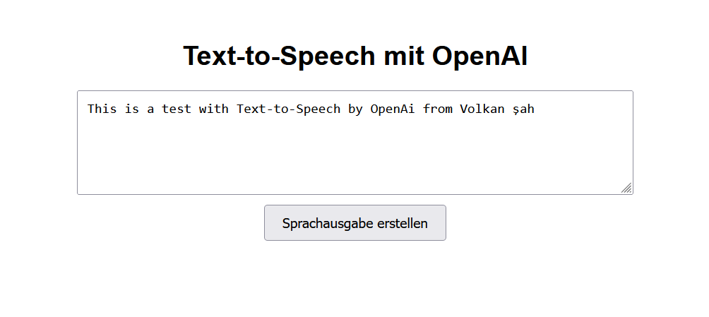

# OpenAI GPT Text-to-Speech Interface

This repository hosts a web application that allows users to convert text to speech using OpenAI's GPT models. It comprises a simple HTML interface for text input and a PHP backend to handle API interactions securely.

## Features

- **Text-to-Speech**: Converts user-entered text into speech.
- **Voice Selection**: Users can choose from multiple voices like Alloy, Echo, Fable, Onyx, Nova, and Shimmer.
- **Secure API Key Handling**: The OpenAI API key is securely stored on the server side.
- **Direct Download**: Generated speech is available for direct download as an MP3 file.

## Technical Components

### `index.html`

- HTML form for user input with a text area and a button to submit text.
- Simple and intuitive CSS styling for a user-friendly interface.

### `tts.php`

- Validates incoming requests as POST.
- Extracts and uses the API key stored server-side to interact with the OpenAI API.
- Receives and processes the user's text, sends it to the OpenAI API, and handles the response.
- Delivers the generated speech as an audio file directly for download or provides an error message if the process fails.

### JavaScript

- Captures the text input and sends it to the server using Fetch API.
- Manages the response from the server, creating a downloadable link for the audio file.

## Setup

1. Clone download the repository:
2. Update the `tts.php` file with your OpenAI API key and voice you want to use (like Alloy, Echo, Fable, Onyx, Nova, and Shimmer).
3. Deploy the application on a PHP 7.x-supported server.

## Usage

- Navigate to `index.html` in your web browser.
- Enter the text you want to convert to speech in the textarea.
- Choose a voice from the available options (not yet implemented in UI, see notes for adding this feature).
- Click the "Sprachausgabe erstellen" button.
- The speech will automatically download as "speech.mp3". [Test speech with voice Alloy](test_speech.mp3)

## Adding Voice Selection Feature (soon)

To add a voice selection feature:
1. Update the HTML to include a dropdown for voice selection.
2. Modify the JavaScript to send the selected voice to `tts.php`.
3. Update the PHP script to use the chosen voice in the API request.

## ❤️ Thank you for your support!
If you appreciate my work, please consider supporting me:

- Become a Sponsor: [Link to my sponsorship page](https://github.com/sponsors/volkansah)
- :star: my projects: Starring projects on GitHub helps increase their visibility and can help others find my work. 
- Follow me: Stay updated with my latest projects and releases.

### 👣 other GPT stuff 
- [GPT-Security-Best-Practices](https://github.com/VolkanSah/GPT-Security-Best-Practices)
- [OpenAi cost calculator](https://github.com/VolkanSah/OpenAI-Cost-Calculator)
- [GPT over CLI](https://github.com/VolkanSah/GPT-over-CLI)
- [Secure Implementation of Artificial Intelligence (AI)](https://github.com/VolkanSah/Implementing-AI-Systems-Whitepaper)
- [Comments Reply with GPT (davinci3)](https://github.com/VolkanSah/GPT-Comments-Reply-WordPress-Plugin)
- [Basic GPT Webinterface](https://github.com/VolkanSah/GPT-API-Integration-in-HTML-CSS-with-JS-PHP)
- [Exploring the Code Interpreter in OpenAI](https://github.com/VolkanSah/The-Code-Interpreter-in-OpenAI-ChatGPT)
- [ChatGPT Shellmaster](https://github.com/VolkanSah/ChatGPT-ShellMaster/)

### Copyright
- [Volkan Kücükbudak //NCF](https://gihub.com/volkansah)

## License
This project is licensed under the [MIT License](LICENSE.md).
